# **Samsung Phone Specification Classifier**


##### Author: Bradley Ouko
---

# **Overview**

By addressing the real-world challenge of understanding mobile phone success factors and setting an affordable price, Samsung can enhance its market position and customer satisfaction. The choice of the Spec_score_binary as the target variable aligns well with the project goals.

The evaluation results indicate strong model performance, especially with the decision tree and random forest classifiers. The perfect accuracy achieved by these models suggests that they are suitable for predicting whether a phone is high-spec or low-spec. The implications for Samsung include optimizing marketing strategies, resource allocation, and overall customer satisfaction.

# **Business Understanding**

# **Business Problem**
Samsung wants to launch a new product in the market. As a data scientist working for Samsung, I have been tasked to gain valuable insights from the dataset related to mobile phones. That way, it can gain an understanding of the factors that contribute to a phone’s success or failure and hence set an affordable price that will increase sales. The goal is to drive sales up📈 by offering a high spec product at an affordable price. Samsung wants to know which features will cost less to produce and have a high profit margin as well when sold.

## **Stakeholders**
1. **Samsung Product Team:**
    * They can use the insights to enhance product features, prioritize improvements, and optimize marketing strategies.

    * **Team Goal:** Improve Samsung’s market share and customer satisfaction.

2. **Sales and Marketing Teams:**
    * They can leverage the findings to tailor advertising campaigns, target specific customer segments, and highlight key features.

    * **Team Goal:** Increase sales and revenue.

3. **Consumers and Potential Buyers:**
    * They benefit indirectly from better products and informed purchasing decisions.

    * **Team Goal:** Make informed choices when buying a phone.

### **Conclusion**
The project’s implications lie in improving Samsung’s competitiveness, understanding customer preferences, and driving innovation. By addressing this problem, Samsung is able to enhance user experiences and hence its success.✅

# **Data Understanding**


## **Dataset Suitability**
The dataset used is from kaggle. It is suitable for the project because it contains relevant information about mobile phones, including specifications, ratings, prices, and features. It covers various aspects that impact a phone’s success in the market. The link to the dataset can be found <a href="https://www.kaggle.com/datasets/dewangmoghe/mobile-phone-price-prediction/data">here</a>.

## **Feature Justification**
1. **Rating**: Captures user satisfaction, which directly affects sales and brand reputation.

2. **Spec_score**: Reflects technical specifications, influencing perceived value.

3. **Price**: Critical for consumer decisions.

4. **Company**: Brand reputation plays a significant role.

5. **Android_version**: Relevant for software compatibility and user experience.

6. **Battery, Camera, RAM, Display**: Key features affecting user satisfaction.

7. **Fast Charging**: A desirable feature.

8. **Processor**: Influences performance.

9. **External_Memory, Inbuilt_memory**: Storage options matter to users.

10. **Screen_resolution**: Affects display quality.

### **Limitations**
1. **Subjectivity**: Ratings are subjective and may not fully represent technical quality.

2. **Missing Data**: Check for missing values and handle them appropriately.

3. **Market Trends**: The dataset might not capture recent trends.

## **Project Objectives**
### **Main Objective:**
Create a machine learning model that predicts the specification rating based on the features. This can comes in handy when the stakeholders want to know which product features are ideal for their new product launch campaign.🚀

**Specific Objectives:**
1. **Feature Selection and Exploration:**
    * Explore relationships between features and the chosen target variable.
    * Identify relevant features for model training.

2. **Model Building and Evaluation:**
    * Develop and evaluate machine learning models (e.g., logistic regression, decision trees, random forests) using the selected target variable.
    * Optimize model performance using appropriate metrics (accuracy, precision, recall, etc.).

3. **Interpretability and Insights:**
    * Interpret model results to understand feature importance.
    * Provide actionable insights for Samsung’s product team.

**Target Variable**

- `Spec_score_binary` is the target variable.

- This binary variable classifies phones as either `High-Spec`(spec_score >= 70) or `Low-Spec`. It directly reflects user satisfaction and guides on product improvements and Quality Control.

*Let's dive into it!*


*Import modules*


```python
#import necessary modules
import pandas as pd
import numpy as np
import plotly.express as px
import matplotlib.pyplot as plt
import seaborn as sns

# Import necessary modules for Modelling
from sklearn.impute import SimpleImputer
from sklearn.model_selection import train_test_split
from sklearn.preprocessing import LabelEncoder

# Imbalanced correction
from imblearn.over_sampling import SMOTE

# Models
from sklearn.model_selection import cross_val_score
from sklearn.linear_model import LogisticRegression
from sklearn import tree
from sklearn.tree import DecisionTreeClassifier
from sklearn.neighbors import KNeighborsClassifier
from sklearn.ensemble import RandomForestClassifier

# Import modeling toolkit
import mods
from mods import DataSourcing, DataPreprocessing, DataAnalysis, DataModeling

# Evaluation metrics
from sklearn.metrics import confusion_matrix, classification_report, accuracy_score, recall_score, f1_score, precision_score

# Plot_roc_curves
from IPython.display import display, HTML
from sklearn.metrics import roc_curve, auc

# Filter warnings
import warnings
warnings.filterwarnings('ignore')

```

*Load the data set.*


```python
# Call the DataSourcing() class
load = DataSourcing()
data = load.open_file('data\mobile_phone_data.csv')
load.dataframe_details(data)
```

    ==============================
    DATAFRAME SHAPE: (1370, 18)
    ============================== 
    
    
    ===============
    DATAFRAME HEAD:
    ===============
       Index                                  Name  Rating  Spec_score  \
    0      0                 Samsung Galaxy F14 5G    4.65          68   
    1      1                    Samsung Galaxy A11    4.20          63   
    2      2                    Samsung Galaxy A13    4.30          75   
    3      3                    Samsung Galaxy F23    4.10          73   
    4      4  Samsung Galaxy A03s (4GB RAM + 64GB)    4.10          69   
    
                           No_of_sim       Ram            Battery     Display  \
    0  Dual Sim, 3G, 4G, 5G, VoLTE,   4 GB RAM  6000 mAh Battery   6.6 inches   
    1      Dual Sim, 3G, 4G, VoLTE,   2 GB RAM  4000 mAh Battery   6.4 inches   
    2      Dual Sim, 3G, 4G, VoLTE,   4 GB RAM  5000 mAh Battery   6.6 inches   
    3      Dual Sim, 3G, 4G, VoLTE,   4 GB RAM   6000 mAh Battery  6.4 inches   
    4      Dual Sim, 3G, 4G, VoLTE,   4 GB RAM  5000 mAh Battery   6.5 inches   
    
                                                  Camera  \
    0    50 MP + 2 MP Dual Rear &amp; 13 MP Front Camera   
    1  13 MP + 5 MP + 2 MP Triple Rear &amp; 8 MP Fro...   
    2            50 MP Quad Rear &amp; 8 MP Front Camera   
    3           48 MP Quad Rear &amp; 13 MP Front Camera   
    4  13 MP + 2 MP + 2 MP Triple Rear &amp; 5 MP Fro...   
    
                          External_Memory Android_version   Price  company  \
    0    Memory Card Supported, upto 1 TB              13   9,999  Samsung   
    1  Memory Card Supported, upto 512 GB              10   9,990  Samsung   
    2    Memory Card Supported, upto 1 TB              12  11,999  Samsung   
    3    Memory Card Supported, upto 1 TB              12  11,999  Samsung   
    4    Memory Card Supported, upto 1 TB              11  11,999  Samsung   
    
        Inbuilt_memory       fast_charging  \
    0   128 GB inbuilt   25W Fast Charging   
    1    32 GB inbuilt   15W Fast Charging   
    2    64 GB inbuilt   25W Fast Charging   
    3    64 GB inbuilt                 NaN   
    4    64 GB inbuilt   15W Fast Charging   
    
                                   Screen_resolution             Processor  \
    0   2408 x 1080 px Display with Water Drop Notch   Octa Core Processor   
    1          720 x 1560 px Display with Punch Hole     1.8 GHz Processor   
    2   1080 x 2408 px Display with Water Drop Notch       2 GHz Processor   
    3                                  720 x 1600 px             Octa Core   
    4    720 x 1600 px Display with Water Drop Notch             Octa Core   
    
      Processor_name  
    0    Exynos 1330  
    1      Octa Core  
    2      Octa Core  
    3      Helio G88  
    4      Helio P35  
    ====================================================================== 
    
    
    ==============================
    DATAFRAME COLUMNS INFO:
    ==============================
    <class 'pandas.core.frame.DataFrame'>
    RangeIndex: 1370 entries, 0 to 1369
    Data columns (total 18 columns):
     #   Column             Non-Null Count  Dtype  
    ---  ------             --------------  -----  
     0   Index              1370 non-null   int64  
     1   Name               1370 non-null   object 
     2   Rating             1370 non-null   float64
     3   Spec_score         1370 non-null   int64  
     4   No_of_sim          1370 non-null   object 
     5   Ram                1370 non-null   object 
     6   Battery            1370 non-null   object 
     7   Display            1370 non-null   object 
     8   Camera             1370 non-null   object 
     9   External_Memory    1370 non-null   object 
     10  Android_version    927 non-null    object 
     11  Price              1370 non-null   object 
     12  company            1370 non-null   object 
     13  Inbuilt_memory     1351 non-null   object 
     14  fast_charging      1281 non-null   object 
     15  Screen_resolution  1368 non-null   object 
     16  Processor          1342 non-null   object 
     17  Processor_name     1370 non-null   object 
    dtypes: float64(1), int64(2), object(15)
    memory usage: 192.8+ KB
    None
    ====================================================================== 
    
    
    ==============================
    DATAFRAME KEY STATISTICS:
    ==============================
                 count        mean         std    min     25%    50%      75%  \
    Index       1370.0  684.500000  395.629246   0.00  342.25  684.5  1026.75   
    Rating      1370.0    4.374416    0.230176   3.75    4.15    4.4     4.55   
    Spec_score  1370.0   80.234307    8.373922  42.00   75.00   82.0    86.00   
    
                    max  
    Index       1369.00  
    Rating         4.75  
    Spec_score    98.00  
    ====================================================================== 
    
    
    

# **Data Preparation**

## **Data Cleaning**

*Feature Engineering* & *Encoding Columns*


```python
# Initialize data preprocessing
dp = DataPreprocessing()

# Convert 'Rating' to binary (good/bad) based on a 
# threshold (4 stars or higher = good)
dp.create_rating_category(data)

# Convert 'Spec_score' to binary (high-spec/low-spec)
# based on a threshold (high-spec >= 70)
dp.create_spec_score_category(data)

# Convert 'Price' to binary (affordable/expensive) 
# based on a threshold (expensive >= upper quartile price)
dp.create_price_category(data)

# Create the Company categories: Samsung, Other Brands
dp.create_company_category(data)

# Convert versions to numeric and create new column: version_category
dp.create_version_category(data)

# Convert column values to binary: Supports fast charging, Does not support fast charging
dp.create_fast_charging_column(data)

# Convert Display to numeric and create new column: display_size_inches
dp.convert_display_to_numeric(data)

# Convert Battery to numeric and create new column: Battery_numeric
dp.convert_battery_to_numeric(data)

# Filters unwanted values in RAM
dp.filter_ram_values(data)


```

### Dealing with missing values
*Check for missing values*


```python
# Use the methods to perform the desired data processing tasks
dp.check_null_values(data)
```

    Index                        0
    Name                         0
    Rating                       0
    Spec_score                   0
    No_of_sim                    0
    Ram                          0
    Battery                      0
    Display                      0
    Camera                       0
    External_Memory              0
    Android_version            443
    Price                        0
    company                      0
    Inbuilt_memory              19
    fast_charging                0
    Screen_resolution            2
    Processor                   28
    Processor_name               0
    Rating_binary                0
    rating_category              0
    Spec_score_binary            0
    Spec_score_category          0
    Price_binary                 0
    Price_category               0
    Company_category             0
    Android_version_cleaned    443
    Android_version_numeric    443
    Version_category             0
    Display_size_inches         16
    Battery_numeric              1
    filtered_ram                20
    dtype: int64
    
    Total number of null values in the data: 1415
    
    ========================================
    List of columns with missing values:
    ========================================
    


    ['Android_version',
     'Inbuilt_memory',
     'Screen_resolution',
     'Processor',
     'Android_version_cleaned',
     'Android_version_numeric',
     'Display_size_inches',
     'Battery_numeric',
     'filtered_ram']


*Impute missing values*


```python
# Impute using the mean and most_frequent strategies
dp.impute_missing_values(data)
dp.check_null_values(data)
```

    There are no null values in the data.
    

*Check for duplicates*


```python
dp.check_duplicates(data)
```

    There are 0 duplicates in the data.
    


```python
# Visualize the dataframe
data.head()
```


<div>
<style scoped>
    .dataframe tbody tr th:only-of-type {
        vertical-align: middle;
    }

    .dataframe tbody tr th {
        vertical-align: top;
    }

    .dataframe thead th {
        text-align: right;
    }
</style>
<table border="1" class="dataframe">
  <thead>
    <tr style="text-align: right;">
      <th></th>
      <th>Index</th>
      <th>Name</th>
      <th>Rating</th>
      <th>Spec_score</th>
      <th>No_of_sim</th>
      <th>Ram</th>
      <th>Battery</th>
      <th>Display</th>
      <th>Camera</th>
      <th>External_Memory</th>
      <th>...</th>
      <th>Spec_score_category</th>
      <th>Price_binary</th>
      <th>Price_category</th>
      <th>Company_category</th>
      <th>Android_version_cleaned</th>
      <th>Android_version_numeric</th>
      <th>Version_category</th>
      <th>Display_size_inches</th>
      <th>Battery_numeric</th>
      <th>filtered_ram</th>
    </tr>
  </thead>
  <tbody>
    <tr>
      <th>0</th>
      <td>0</td>
      <td>Samsung Galaxy F14 5G</td>
      <td>4.65</td>
      <td>68</td>
      <td>Dual Sim, 3G, 4G, 5G, VoLTE,</td>
      <td>4 GB RAM</td>
      <td>6000 mAh Battery</td>
      <td>6.6 inches</td>
      <td>50 MP + 2 MP Dual Rear &amp;amp; 13 MP Front Camera</td>
      <td>Memory Card Supported, upto 1 TB</td>
      <td>...</td>
      <td>Low-Spec</td>
      <td>1</td>
      <td>Affordable</td>
      <td>Samsung</td>
      <td>13</td>
      <td>13.0</td>
      <td>Android 11+</td>
      <td>6.6</td>
      <td>6000.0</td>
      <td>4 GB RAM</td>
    </tr>
    <tr>
      <th>1</th>
      <td>1</td>
      <td>Samsung Galaxy A11</td>
      <td>4.20</td>
      <td>63</td>
      <td>Dual Sim, 3G, 4G, VoLTE,</td>
      <td>2 GB RAM</td>
      <td>4000 mAh Battery</td>
      <td>6.4 inches</td>
      <td>13 MP + 5 MP + 2 MP Triple Rear &amp;amp; 8 MP Fro...</td>
      <td>Memory Card Supported, upto 512 GB</td>
      <td>...</td>
      <td>Low-Spec</td>
      <td>1</td>
      <td>Affordable</td>
      <td>Samsung</td>
      <td>10</td>
      <td>10.0</td>
      <td>Older Versions</td>
      <td>6.4</td>
      <td>4000.0</td>
      <td>2 GB RAM</td>
    </tr>
    <tr>
      <th>2</th>
      <td>2</td>
      <td>Samsung Galaxy A13</td>
      <td>4.30</td>
      <td>75</td>
      <td>Dual Sim, 3G, 4G, VoLTE,</td>
      <td>4 GB RAM</td>
      <td>5000 mAh Battery</td>
      <td>6.6 inches</td>
      <td>50 MP Quad Rear &amp;amp; 8 MP Front Camera</td>
      <td>Memory Card Supported, upto 1 TB</td>
      <td>...</td>
      <td>Low-Spec</td>
      <td>1</td>
      <td>Affordable</td>
      <td>Samsung</td>
      <td>12</td>
      <td>12.0</td>
      <td>Android 11+</td>
      <td>6.6</td>
      <td>5000.0</td>
      <td>4 GB RAM</td>
    </tr>
    <tr>
      <th>3</th>
      <td>3</td>
      <td>Samsung Galaxy F23</td>
      <td>4.10</td>
      <td>73</td>
      <td>Dual Sim, 3G, 4G, VoLTE,</td>
      <td>4 GB RAM</td>
      <td>6000 mAh Battery</td>
      <td>6.4 inches</td>
      <td>48 MP Quad Rear &amp;amp; 13 MP Front Camera</td>
      <td>Memory Card Supported, upto 1 TB</td>
      <td>...</td>
      <td>Low-Spec</td>
      <td>1</td>
      <td>Affordable</td>
      <td>Samsung</td>
      <td>12</td>
      <td>12.0</td>
      <td>Android 11+</td>
      <td>6.4</td>
      <td>6000.0</td>
      <td>4 GB RAM</td>
    </tr>
    <tr>
      <th>4</th>
      <td>4</td>
      <td>Samsung Galaxy A03s (4GB RAM + 64GB)</td>
      <td>4.10</td>
      <td>69</td>
      <td>Dual Sim, 3G, 4G, VoLTE,</td>
      <td>4 GB RAM</td>
      <td>5000 mAh Battery</td>
      <td>6.5 inches</td>
      <td>13 MP + 2 MP + 2 MP Triple Rear &amp;amp; 5 MP Fro...</td>
      <td>Memory Card Supported, upto 1 TB</td>
      <td>...</td>
      <td>Low-Spec</td>
      <td>1</td>
      <td>Affordable</td>
      <td>Samsung</td>
      <td>11</td>
      <td>11.0</td>
      <td>Android 11+</td>
      <td>6.5</td>
      <td>5000.0</td>
      <td>4 GB RAM</td>
    </tr>
  </tbody>
</table>
<p>5 rows × 31 columns</p>
</div>


# **Data Analysis**


*Create box plots and histograms for all numeric columns*


```python
# Initialize the Data Visualization and Analysis class
eda= DataAnalysis(data)

numeric_columns = data.select_dtypes(include=['int64', 'float64']).columns
categorical_columns = data.select_dtypes(include=['object', 'bool']).columns
numeric_col_li = data.select_dtypes(include=['int64', 'float64']).columns.to_list()
numeric_cols = [col for col in numeric_col_li if col != 'Index']

# Display plots for numeric columns
eda.plot_boxplots(data, numeric_cols)
eda.plot_histograms(data, numeric_cols)
```


    
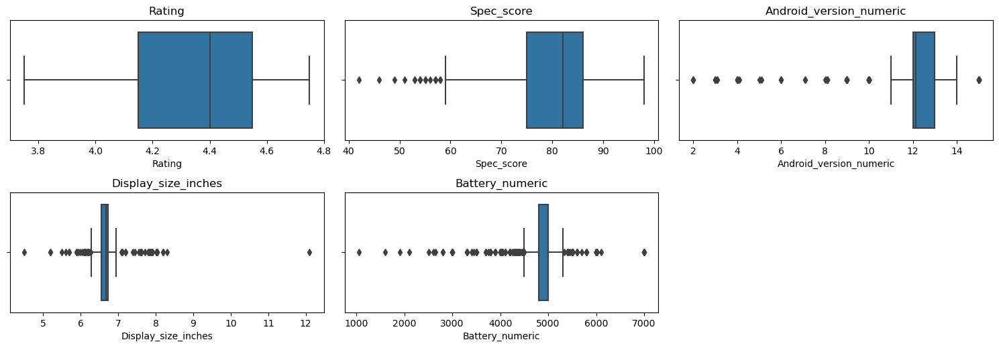
    


    
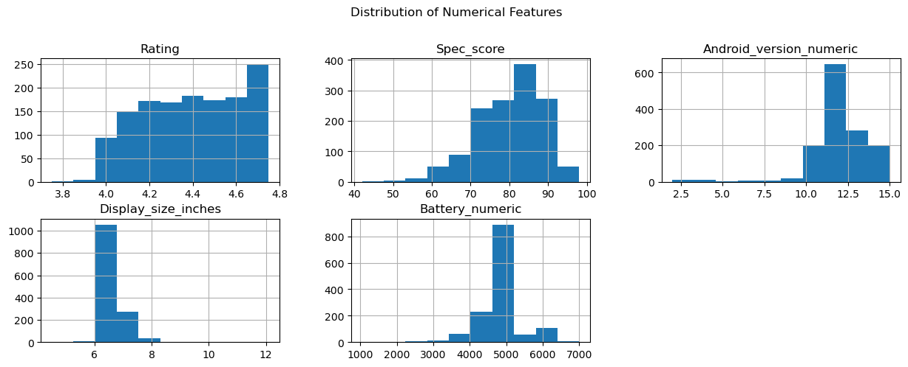
    


*Plot count plots to visualize column categories*


```python
relevant_cols = ['fast_charging', 'Version_category', 'Company_category',
                 'rating_category', 'Spec_score_category', 'Price_category']

eda.plot_countplots(data, relevant_cols)
```


    
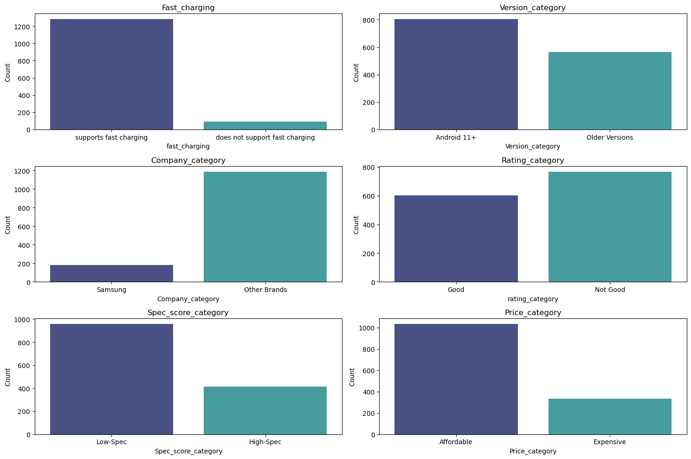
    


```python
# List of columns to exclude
exclude = ['Index','Ram', 'Android_version', 'fast_charging', 'Version_category', 'Company_category',
            'Rating', 'Spec_score', 'Android_version_numeric', 'Name',
            'Battery', 'Display', 'Camera', 'External_Memory', 'Screen_resolution',
            'Processor_name', 'Price_binary', 'Spec_score_binary', 'Rating_binary',
            'Spec_score_category', 'rating_category','Price_category', 'Android_version_cleaned']

# Call the function with the DataFrame and the list of columns to exclude
eda.check_distribution(data, exclude_columns=exclude)

```


    
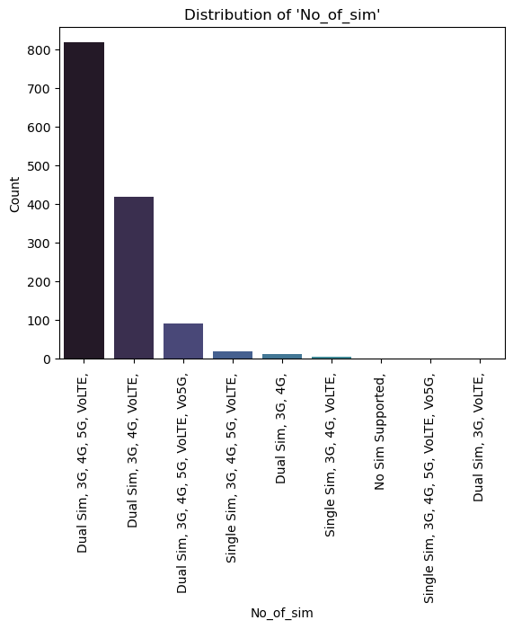
    


    
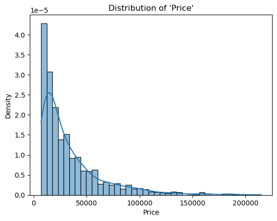
    


    
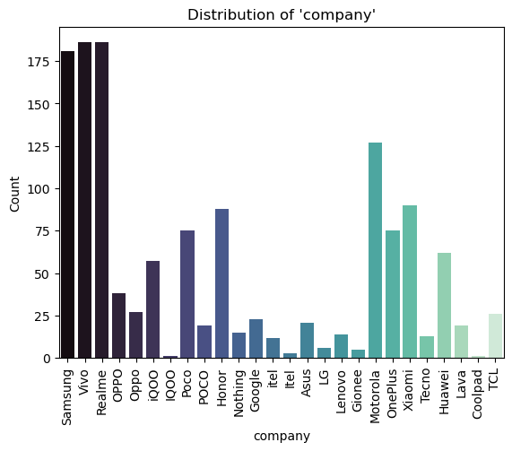
    


    
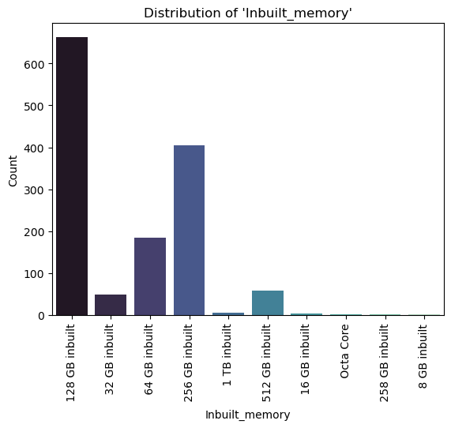
    


    
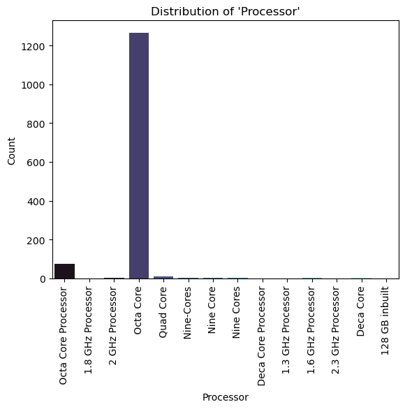
    


    
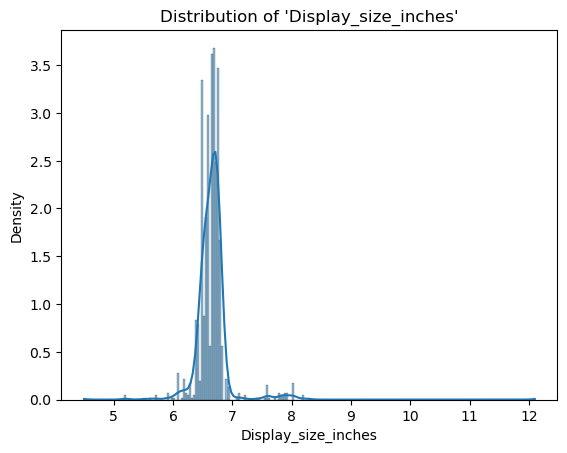
    


    
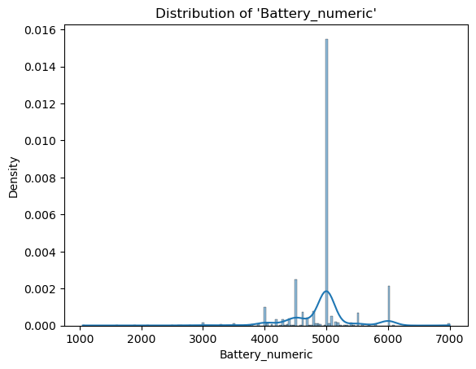
    


    
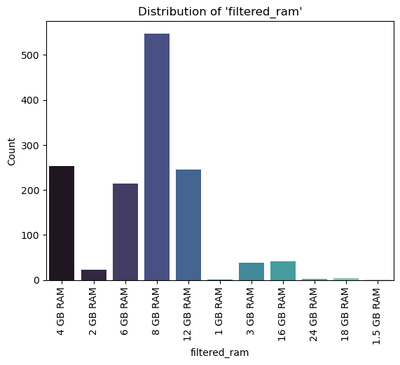
    


    
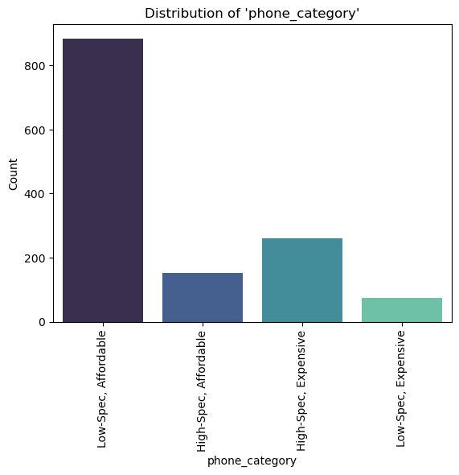
    


*Further feature Encoding for correlation analysis purposes*


```python
# One-hot encode categorical variables
new_data = eda.encode_categorical_features(data)
```


```python
new_data.columns
```


    Index(['Index', 'Name', 'Rating', 'Spec_score', 'Battery', 'Display', 'Camera',
           'External_Memory', 'Android_version', 'Price', 'company',
           'fast_charging', 'Screen_resolution', 'Processor_name', 'Rating_binary',
           'rating_category', 'Spec_score_binary', 'Spec_score_category',
           'Price_binary', 'Price_category', 'Android_version_cleaned',
           'Android_version_numeric', 'Version_category', 'Display_size_inches',
           'Battery_numeric', 'filtered_ram', 'No_of_sim_Dual Sim, 3G, 4G, ',
           'No_of_sim_Dual Sim, 3G, 4G, 5G, VoLTE, ',
           'No_of_sim_Dual Sim, 3G, 4G, 5G, VoLTE, Vo5G, ',
           'No_of_sim_Dual Sim, 3G, 4G, VoLTE, ',
           'No_of_sim_Dual Sim, 3G, VoLTE, ', 'No_of_sim_No Sim Supported, ',
           'No_of_sim_Single Sim, 3G, 4G, 5G, VoLTE, ',
           'No_of_sim_Single Sim, 3G, 4G, 5G, VoLTE, Vo5G, ',
           'No_of_sim_Single Sim, 3G, 4G, VoLTE, ', 'Ram_1 GB RAM',
           'Ram_1.5 GB RAM', 'Ram_12 GB RAM', 'Ram_128 GB inbuilt',
           'Ram_16 GB RAM', 'Ram_18 GB RAM', 'Ram_2 GB RAM', 'Ram_24 GB RAM',
           'Ram_256 GB inbuilt', 'Ram_3 GB RAM', 'Ram_4 GB RAM',
           'Ram_512 GB inbuilt', 'Ram_6 GB RAM',
           'Ram_6000 mAh Battery with 22.5W Fast Charging', 'Ram_8 GB RAM',
           'Ram_Helio G90T', 'Company_category_Other Brands',
           'Company_category_Samsung', 'Inbuilt_memory_ 1 TB inbuilt',
           'Inbuilt_memory_ 128 GB inbuilt', 'Inbuilt_memory_ 16 GB inbuilt',
           'Inbuilt_memory_ 256 GB inbuilt', 'Inbuilt_memory_ 258 GB inbuilt',
           'Inbuilt_memory_ 32 GB inbuilt', 'Inbuilt_memory_ 512 GB inbuilt',
           'Inbuilt_memory_ 64 GB inbuilt', 'Inbuilt_memory_ 8 GB inbuilt',
           'Inbuilt_memory_ Octa Core', 'Processor_ 1.3 GHz Processor',
           'Processor_ 1.6 GHz Processor', 'Processor_ 1.8 GHz Processor',
           'Processor_ 128 GB inbuilt', 'Processor_ 2 GHz Processor',
           'Processor_ 2.3 GHz Processor', 'Processor_ Deca Core',
           'Processor_ Deca Core Processor', 'Processor_ Nine Core',
           'Processor_ Nine Cores', 'Processor_ Nine-Cores',
           'Processor_ Octa Core', 'Processor_ Octa Core Processor',
           'Processor_ Quad Core'],
          dtype='object')


*Correlation Analysis*


```python
eda.correlation(data)
```

    The following columns were dropped due to being object types:
    ['Name', 'No_of_sim', 'Ram', 'Battery', 'Display', 'Camera', 'External_Memory', 'Android_version', 'company', 'Inbuilt_memory', 'fast_charging', 'Screen_resolution', 'Processor', 'Processor_name', 'rating_category', 'Spec_score_category', 'Price_category', 'Company_category', 'Android_version_cleaned', 'Version_category', 'filtered_ram']
    


<div>
<style scoped>
    .dataframe tbody tr th:only-of-type {
        vertical-align: middle;
    }

    .dataframe tbody tr th {
        vertical-align: top;
    }

    .dataframe thead th {
        text-align: right;
    }
</style>
<table border="1" class="dataframe">
  <thead>
    <tr style="text-align: right;">
      <th></th>
      <th>Index</th>
      <th>Rating</th>
      <th>Spec_score</th>
      <th>Price</th>
      <th>Rating_binary</th>
      <th>Spec_score_binary</th>
      <th>Price_binary</th>
      <th>Android_version_numeric</th>
      <th>Display_size_inches</th>
      <th>Battery_numeric</th>
    </tr>
  </thead>
  <tbody>
    <tr>
      <th>Index</th>
      <td>1.000000</td>
      <td>0.026233</td>
      <td>-0.044236</td>
      <td>-0.076589</td>
      <td>0.041443</td>
      <td>-0.086762</td>
      <td>0.050750</td>
      <td>-0.049842</td>
      <td>-0.001671</td>
      <td>0.018930</td>
    </tr>
    <tr>
      <th>Rating</th>
      <td>0.026233</td>
      <td>1.000000</td>
      <td>0.056510</td>
      <td>0.004403</td>
      <td>0.852661</td>
      <td>0.035216</td>
      <td>0.004276</td>
      <td>0.043829</td>
      <td>0.046106</td>
      <td>0.087285</td>
    </tr>
    <tr>
      <th>Spec_score</th>
      <td>-0.044236</td>
      <td>0.056510</td>
      <td>1.000000</td>
      <td>0.644035</td>
      <td>0.042030</td>
      <td>0.682920</td>
      <td>-0.533675</td>
      <td>0.189046</td>
      <td>0.344731</td>
      <td>0.035791</td>
    </tr>
    <tr>
      <th>Price</th>
      <td>-0.076589</td>
      <td>0.004403</td>
      <td>0.644035</td>
      <td>1.000000</td>
      <td>-0.001914</td>
      <td>0.621674</td>
      <td>-0.803786</td>
      <td>-0.011104</td>
      <td>0.449951</td>
      <td>-0.158609</td>
    </tr>
    <tr>
      <th>Rating_binary</th>
      <td>0.041443</td>
      <td>0.852661</td>
      <td>0.042030</td>
      <td>-0.001914</td>
      <td>1.000000</td>
      <td>0.026500</td>
      <td>0.013552</td>
      <td>0.033417</td>
      <td>0.026194</td>
      <td>0.072936</td>
    </tr>
    <tr>
      <th>Spec_score_binary</th>
      <td>-0.086762</td>
      <td>0.035216</td>
      <td>0.682920</td>
      <td>0.621674</td>
      <td>0.026500</td>
      <td>1.000000</td>
      <td>-0.593485</td>
      <td>0.056186</td>
      <td>0.260442</td>
      <td>-0.097654</td>
    </tr>
    <tr>
      <th>Price_binary</th>
      <td>0.050750</td>
      <td>0.004276</td>
      <td>-0.533675</td>
      <td>-0.803786</td>
      <td>0.013552</td>
      <td>-0.593485</td>
      <td>1.000000</td>
      <td>0.053860</td>
      <td>-0.298294</td>
      <td>0.136713</td>
    </tr>
    <tr>
      <th>Android_version_numeric</th>
      <td>-0.049842</td>
      <td>0.043829</td>
      <td>0.189046</td>
      <td>-0.011104</td>
      <td>0.033417</td>
      <td>0.056186</td>
      <td>0.053860</td>
      <td>1.000000</td>
      <td>0.197192</td>
      <td>0.227011</td>
    </tr>
    <tr>
      <th>Display_size_inches</th>
      <td>-0.001671</td>
      <td>0.046106</td>
      <td>0.344731</td>
      <td>0.449951</td>
      <td>0.026194</td>
      <td>0.260442</td>
      <td>-0.298294</td>
      <td>0.197192</td>
      <td>1.000000</td>
      <td>0.070953</td>
    </tr>
    <tr>
      <th>Battery_numeric</th>
      <td>0.018930</td>
      <td>0.087285</td>
      <td>0.035791</td>
      <td>-0.158609</td>
      <td>0.072936</td>
      <td>-0.097654</td>
      <td>0.136713</td>
      <td>0.227011</td>
      <td>0.070953</td>
      <td>1.000000</td>
    </tr>
  </tbody>
</table>
</div>


```python
eda.plot_correlation_heatmap(new_data, column_of_interest='Spec_score_binary')
```

    The following columns were dropped due to being object types:
    ['Name', 'Battery', 'Display', 'Camera', 'External_Memory', 'Android_version', 'company', 'fast_charging', 'Screen_resolution', 'Processor_name', 'rating_category', 'Spec_score_category', 'Price_category', 'Android_version_cleaned', 'Version_category', 'filtered_ram']
    Correlation to Spec_score_binary
    


    
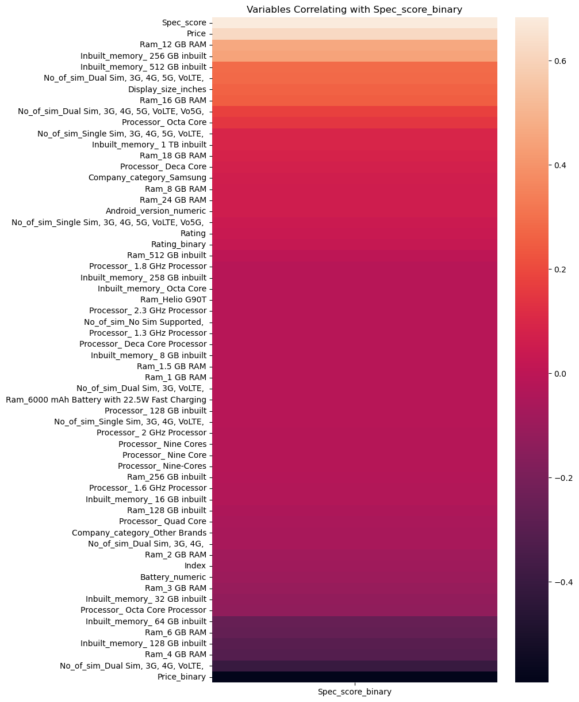
    


```python
eda.plot_correlation_heatmap(new_data, column_of_interest='Price')
```

    The following columns were dropped due to being object types:
    ['Name', 'Battery', 'Display', 'Camera', 'External_Memory', 'Android_version', 'company', 'fast_charging', 'Screen_resolution', 'Processor_name', 'rating_category', 'Spec_score_category', 'Price_category', 'Android_version_cleaned', 'Version_category', 'filtered_ram']
    Correlation to Price
    


    
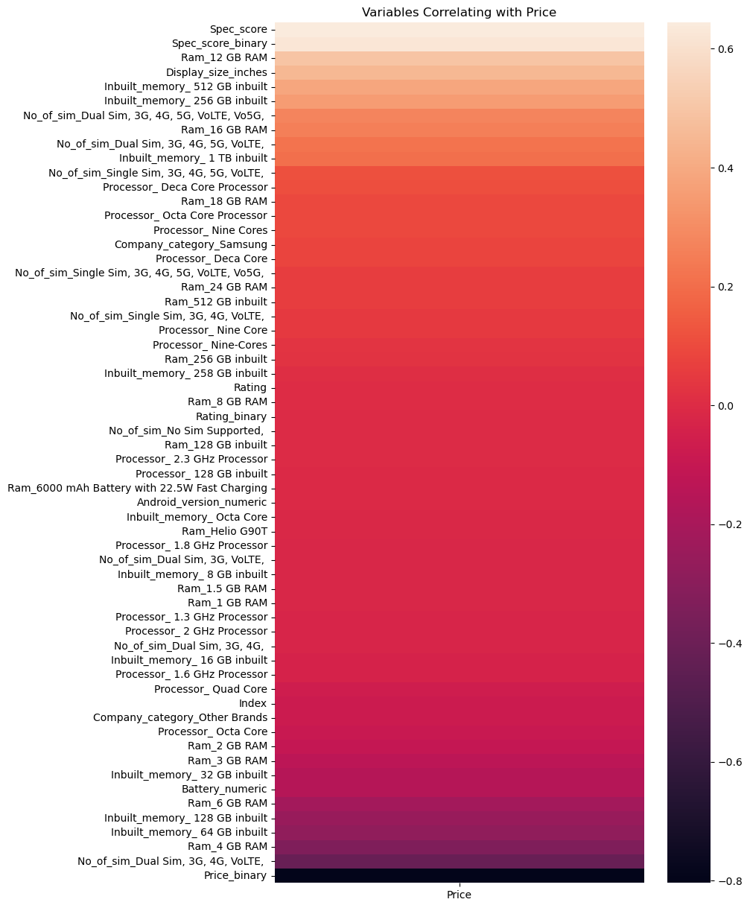
    


```python
eda.plot_correlation_heatmap(new_data, column_of_interest='Price_binary')
```

    The following columns were dropped due to being object types:
    ['Name', 'Battery', 'Display', 'Camera', 'External_Memory', 'Android_version', 'company', 'fast_charging', 'Screen_resolution', 'Processor_name', 'rating_category', 'Spec_score_category', 'Price_category', 'Android_version_cleaned', 'Version_category', 'filtered_ram']
    Correlation to Price_binary
    


    
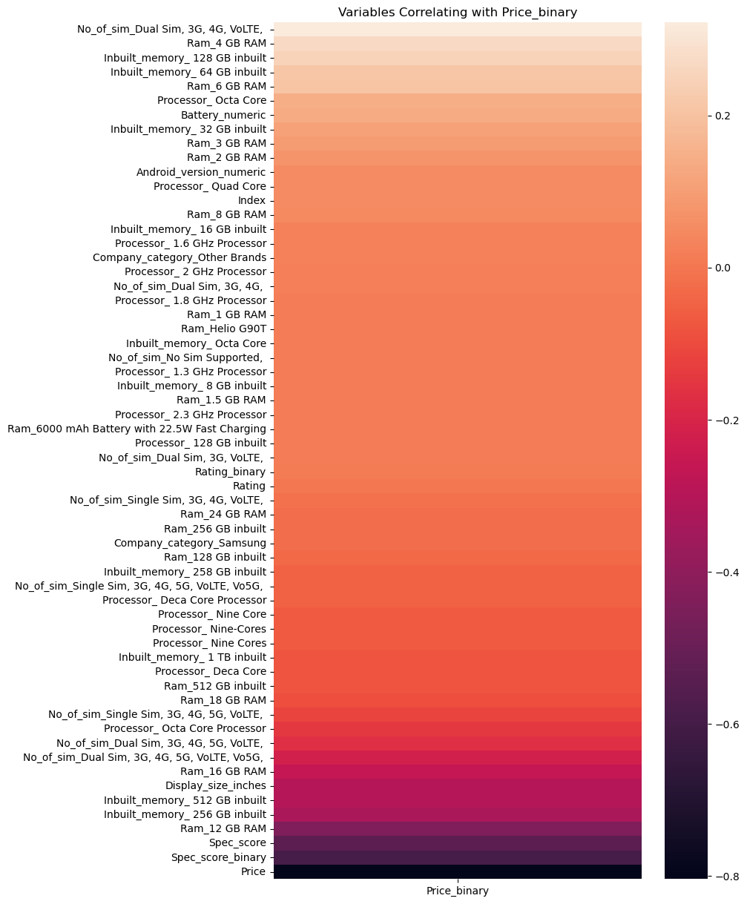
    


# **Data Modelling**


*Drop columns for modelling purposes*


```python
# Drop columns no longer applicable in this section
object_columns = new_data.select_dtypes(include=['object'])
obj_col_list = object_columns.columns.tolist()

eda.drop_columns(new_data, obj_col_list)
# Drop columns with high correlation with target variables
high_cor_list = ['Price', 'Spec_score']
mod_data = eda.drop_columns(new_data, high_cor_list)
```

*Model the data*
### **Base Model - Phone Specification Classifier (High-Spec or Low-Spec)**
---

*Initialize the Data Modeling class*


```python
mod = DataModeling(new_data)
```

*Split the data into training and testing sets*


```python
# Base Model
# Split the data into features and Spec_score_binary
X_train, X_test, y_train, y_test= mod.split_data(new_data, 'Spec_score_binary')
```


```python
X_train.shape
```


    (959, 58)


```python
y_train.shape
```


    (959,)


```python
mod.modelplotting_evaluation(X_train, X_test, y_train, y_test)
```

    Model: LogisticRegression(random_state=42)
    --------------------------------------------------------------------------------
    Confusion matrix:
    
     [[273  10]
     [ 48  80]]
    
    Classification report:               precision    recall  f1-score   support
    
               0       0.85      0.96      0.90       283
               1       0.89      0.62      0.73       128
    
        accuracy                           0.86       411
       macro avg       0.87      0.79      0.82       411
    weighted avg       0.86      0.86      0.85       411
    
    Accuracy: 0.8588807785888077
    Precision: 0.8888888888888888
    Recall: 0.625
    F1 score: 0.7339449541284404
    --------------------------------------------------------------------------------
    
    Cross-Validation Scores: [0.86979167 0.90625    0.84895833 0.86979167 0.90575916]
    Mean CV Accuracy: 0.8801101657940663
    
    --------------------------------------------------------------------------------
    Model: DecisionTreeClassifier(random_state=42)
    --------------------------------------------------------------------------------
    Confusion matrix:
    
     [[253  30]
     [ 34  94]]
    
    Classification report:               precision    recall  f1-score   support
    
               0       0.88      0.89      0.89       283
               1       0.76      0.73      0.75       128
    
        accuracy                           0.84       411
       macro avg       0.82      0.81      0.82       411
    weighted avg       0.84      0.84      0.84       411
    
    Accuracy: 0.8442822384428224
    Precision: 0.7580645161290323
    Recall: 0.734375
    F1 score: 0.7460317460317459
    --------------------------------------------------------------------------------
    
    Cross-Validation Scores: [0.88541667 0.88020833 0.82291667 0.828125   0.86910995]
    Mean CV Accuracy: 0.857155322862129
    
    --------------------------------------------------------------------------------
    Model: RandomForestClassifier(random_state=42)
    --------------------------------------------------------------------------------
    Confusion matrix:
    
     [[265  18]
     [ 33  95]]
    
    Classification report:               precision    recall  f1-score   support
    
               0       0.89      0.94      0.91       283
               1       0.84      0.74      0.79       128
    
        accuracy                           0.88       411
       macro avg       0.86      0.84      0.85       411
    weighted avg       0.87      0.88      0.87       411
    
    Accuracy: 0.8759124087591241
    Precision: 0.8407079646017699
    Recall: 0.7421875
    F1 score: 0.7883817427385892
    --------------------------------------------------------------------------------
    
    Cross-Validation Scores: [0.85416667 0.90625    0.84895833 0.859375   0.89528796]
    Mean CV Accuracy: 0.8728075916230367
    
    --------------------------------------------------------------------------------
    Model: KNeighborsClassifier()
    --------------------------------------------------------------------------------
    Confusion matrix:
    
     [[252  31]
     [ 59  69]]
    
    Classification report:               precision    recall  f1-score   support
    
               0       0.81      0.89      0.85       283
               1       0.69      0.54      0.61       128
    
        accuracy                           0.78       411
       macro avg       0.75      0.71      0.73       411
    weighted avg       0.77      0.78      0.77       411
    
    Accuracy: 0.781021897810219
    Precision: 0.69
    Recall: 0.5390625
    F1 score: 0.6052631578947368
    --------------------------------------------------------------------------------
    
    Cross-Validation Scores: [0.77604167 0.80208333 0.73958333 0.70833333 0.7486911 ]
    Mean CV Accuracy: 0.7549465532286213
    
    --------------------------------------------------------------------------------
    


<div>
<style scoped>
    .dataframe tbody tr th:only-of-type {
        vertical-align: middle;
    }

    .dataframe tbody tr th {
        vertical-align: top;
    }

    .dataframe thead th {
        text-align: right;
    }
</style>
<table border="1" class="dataframe">
  <thead>
    <tr style="text-align: right;">
      <th></th>
      <th>Model</th>
      <th>Accuracy</th>
      <th>Recall</th>
      <th>Precision</th>
      <th>F1</th>
    </tr>
  </thead>
  <tbody>
    <tr>
      <th>0</th>
      <td>LogisticRegression(random_state=42)</td>
      <td>0.858881</td>
      <td>0.625000</td>
      <td>0.888889</td>
      <td>0.733945</td>
    </tr>
    <tr>
      <th>1</th>
      <td>DecisionTreeClassifier(random_state=42)</td>
      <td>0.844282</td>
      <td>0.734375</td>
      <td>0.758065</td>
      <td>0.746032</td>
    </tr>
    <tr>
      <th>2</th>
      <td>RandomForestClassifier(random_state=42)</td>
      <td>0.875912</td>
      <td>0.742188</td>
      <td>0.840708</td>
      <td>0.788382</td>
    </tr>
    <tr>
      <th>3</th>
      <td>KNeighborsClassifier()</td>
      <td>0.781022</td>
      <td>0.539062</td>
      <td>0.690000</td>
      <td>0.605263</td>
    </tr>
  </tbody>
</table>
</div>


*Apply SMOTE to deal with class imbalance*


```python
X_train_resampled, y_train_resampled = mod.apply_smote(X_train, y_train)
```


```python
mod.modelplotting_evaluation(X_train_resampled, X_test, y_train_resampled, y_test)
```

    Model: LogisticRegression(random_state=42)
    --------------------------------------------------------------------------------
    Confusion matrix:
    
     [[244  39]
     [ 19 109]]
    
    Classification report:               precision    recall  f1-score   support
    
               0       0.93      0.86      0.89       283
               1       0.74      0.85      0.79       128
    
        accuracy                           0.86       411
       macro avg       0.83      0.86      0.84       411
    weighted avg       0.87      0.86      0.86       411
    
    Accuracy: 0.8588807785888077
    Precision: 0.7364864864864865
    Recall: 0.8515625
    F1 score: 0.7898550724637682
    --------------------------------------------------------------------------------
    
    Cross-Validation Scores: [0.84810127 0.80508475 0.86864407 0.91949153 0.86016949]
    Mean CV Accuracy: 0.8602982192662518
    
    --------------------------------------------------------------------------------
    Model: DecisionTreeClassifier(random_state=42)
    --------------------------------------------------------------------------------
    Confusion matrix:
    
     [[258  25]
     [ 40  88]]
    
    Classification report:               precision    recall  f1-score   support
    
               0       0.87      0.91      0.89       283
               1       0.78      0.69      0.73       128
    
        accuracy                           0.84       411
       macro avg       0.82      0.80      0.81       411
    weighted avg       0.84      0.84      0.84       411
    
    Accuracy: 0.8418491484184915
    Precision: 0.7787610619469026
    Recall: 0.6875
    F1 score: 0.7302904564315352
    --------------------------------------------------------------------------------
    
    Cross-Validation Scores: [0.81012658 0.81779661 0.82627119 0.92372881 0.91949153]
    Mean CV Accuracy: 0.8594829435743403
    
    --------------------------------------------------------------------------------
    Model: RandomForestClassifier(random_state=42)
    --------------------------------------------------------------------------------
    Confusion matrix:
    
     [[260  23]
     [ 29  99]]
    
    Classification report:               precision    recall  f1-score   support
    
               0       0.90      0.92      0.91       283
               1       0.81      0.77      0.79       128
    
        accuracy                           0.87       411
       macro avg       0.86      0.85      0.85       411
    weighted avg       0.87      0.87      0.87       411
    
    Accuracy: 0.8734793187347932
    Precision: 0.8114754098360656
    Recall: 0.7734375
    F1 score: 0.792
    --------------------------------------------------------------------------------
    
    Cross-Validation Scores: [0.86919831 0.84322034 0.88135593 0.95762712 0.93220339]
    Mean CV Accuracy: 0.8967210183794607
    
    --------------------------------------------------------------------------------
    Model: KNeighborsClassifier()
    --------------------------------------------------------------------------------
    Confusion matrix:
    
     [[235  48]
     [ 39  89]]
    
    Classification report:               precision    recall  f1-score   support
    
               0       0.86      0.83      0.84       283
               1       0.65      0.70      0.67       128
    
        accuracy                           0.79       411
       macro avg       0.75      0.76      0.76       411
    weighted avg       0.79      0.79      0.79       411
    
    Accuracy: 0.7883211678832117
    Precision: 0.6496350364963503
    Recall: 0.6953125
    F1 score: 0.6716981132075471
    --------------------------------------------------------------------------------
    
    Cross-Validation Scores: [0.8185654  0.76694915 0.75847458 0.77118644 0.77118644]
    Mean CV Accuracy: 0.7772724022026747
    
    --------------------------------------------------------------------------------
    


<div>
<style scoped>
    .dataframe tbody tr th:only-of-type {
        vertical-align: middle;
    }

    .dataframe tbody tr th {
        vertical-align: top;
    }

    .dataframe thead th {
        text-align: right;
    }
</style>
<table border="1" class="dataframe">
  <thead>
    <tr style="text-align: right;">
      <th></th>
      <th>Model</th>
      <th>Accuracy</th>
      <th>Recall</th>
      <th>Precision</th>
      <th>F1</th>
    </tr>
  </thead>
  <tbody>
    <tr>
      <th>0</th>
      <td>LogisticRegression(random_state=42)</td>
      <td>0.858881</td>
      <td>0.851562</td>
      <td>0.736486</td>
      <td>0.789855</td>
    </tr>
    <tr>
      <th>1</th>
      <td>DecisionTreeClassifier(random_state=42)</td>
      <td>0.841849</td>
      <td>0.687500</td>
      <td>0.778761</td>
      <td>0.730290</td>
    </tr>
    <tr>
      <th>2</th>
      <td>RandomForestClassifier(random_state=42)</td>
      <td>0.873479</td>
      <td>0.773438</td>
      <td>0.811475</td>
      <td>0.792000</td>
    </tr>
    <tr>
      <th>3</th>
      <td>KNeighborsClassifier()</td>
      <td>0.788321</td>
      <td>0.695312</td>
      <td>0.649635</td>
      <td>0.671698</td>
    </tr>
  </tbody>
</table>
</div>


```python
models = [mod.lr, mod.dc, mod.rf, mod.knn]

mod.plot_roc_curves(models,X_train_resampled, y_train_resampled, X_test, y_test)
```


    
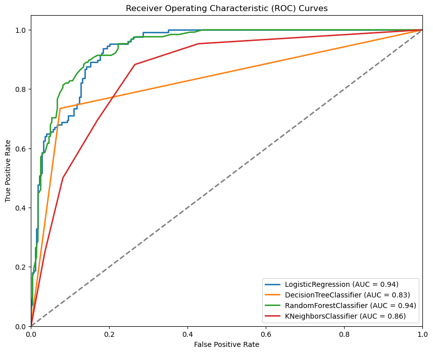
    


### **Model 2 - Phone Price Classifier (Expensive or Affordable)**
---


```python
X_train, X_test, y_train, y_test= mod.split_data(new_data, 'Price_binary')
mod.modelplotting_evaluation(X_train, X_test, y_train, y_test)
```

    Model: LogisticRegression(random_state=42)
    --------------------------------------------------------------------------------
    Confusion matrix:
    
     [[ 67  27]
     [ 34 283]]
    
    Classification report:               precision    recall  f1-score   support
    
               0       0.66      0.71      0.69        94
               1       0.91      0.89      0.90       317
    
        accuracy                           0.85       411
       macro avg       0.79      0.80      0.79       411
    weighted avg       0.86      0.85      0.85       411
    
    Accuracy: 0.851581508515815
    Precision: 0.9129032258064517
    Recall: 0.8927444794952681
    F1 score: 0.9027113237639554
    --------------------------------------------------------------------------------
    
    Cross-Validation Scores: [0.88541667 0.875      0.86458333 0.84895833 0.89005236]
    Mean CV Accuracy: 0.8728021378708553
    
    --------------------------------------------------------------------------------
    Model: DecisionTreeClassifier(random_state=42)
    --------------------------------------------------------------------------------
    Confusion matrix:
    
     [[ 72  22]
     [ 23 294]]
    
    Classification report:               precision    recall  f1-score   support
    
               0       0.76      0.77      0.76        94
               1       0.93      0.93      0.93       317
    
        accuracy                           0.89       411
       macro avg       0.84      0.85      0.85       411
    weighted avg       0.89      0.89      0.89       411
    
    Accuracy: 0.8905109489051095
    Precision: 0.930379746835443
    Recall: 0.9274447949526814
    F1 score: 0.928909952606635
    --------------------------------------------------------------------------------
    
    Cross-Validation Scores: [0.84375    0.890625   0.859375   0.86979167 0.87958115]
    Mean CV Accuracy: 0.8686245636998254
    
    --------------------------------------------------------------------------------
    Model: RandomForestClassifier(random_state=42)
    --------------------------------------------------------------------------------
    Confusion matrix:
    
     [[ 73  21]
     [ 27 290]]
    
    Classification report:               precision    recall  f1-score   support
    
               0       0.73      0.78      0.75        94
               1       0.93      0.91      0.92       317
    
        accuracy                           0.88       411
       macro avg       0.83      0.85      0.84       411
    weighted avg       0.89      0.88      0.88       411
    
    Accuracy: 0.8832116788321168
    Precision: 0.932475884244373
    Recall: 0.9148264984227129
    F1 score: 0.9235668789808917
    --------------------------------------------------------------------------------
    
    Cross-Validation Scores: [0.89583333 0.89583333 0.890625   0.86458333 0.89528796]
    Mean CV Accuracy: 0.8884325916230367
    
    --------------------------------------------------------------------------------
    Model: KNeighborsClassifier()
    --------------------------------------------------------------------------------
    Confusion matrix:
    
     [[ 58  36]
     [ 23 294]]
    
    Classification report:               precision    recall  f1-score   support
    
               0       0.72      0.62      0.66        94
               1       0.89      0.93      0.91       317
    
        accuracy                           0.86       411
       macro avg       0.80      0.77      0.79       411
    weighted avg       0.85      0.86      0.85       411
    
    Accuracy: 0.8564476885644768
    Precision: 0.8909090909090909
    Recall: 0.9274447949526814
    F1 score: 0.9088098918083461
    --------------------------------------------------------------------------------
    
    Cross-Validation Scores: [0.83333333 0.83333333 0.82291667 0.80729167 0.81675393]
    Mean CV Accuracy: 0.8227257853403142
    
    --------------------------------------------------------------------------------
    


<div>
<style scoped>
    .dataframe tbody tr th:only-of-type {
        vertical-align: middle;
    }

    .dataframe tbody tr th {
        vertical-align: top;
    }

    .dataframe thead th {
        text-align: right;
    }
</style>
<table border="1" class="dataframe">
  <thead>
    <tr style="text-align: right;">
      <th></th>
      <th>Model</th>
      <th>Accuracy</th>
      <th>Recall</th>
      <th>Precision</th>
      <th>F1</th>
    </tr>
  </thead>
  <tbody>
    <tr>
      <th>0</th>
      <td>LogisticRegression(random_state=42)</td>
      <td>0.851582</td>
      <td>0.892744</td>
      <td>0.912903</td>
      <td>0.902711</td>
    </tr>
    <tr>
      <th>1</th>
      <td>DecisionTreeClassifier(random_state=42)</td>
      <td>0.890511</td>
      <td>0.927445</td>
      <td>0.930380</td>
      <td>0.928910</td>
    </tr>
    <tr>
      <th>2</th>
      <td>RandomForestClassifier(random_state=42)</td>
      <td>0.883212</td>
      <td>0.914826</td>
      <td>0.932476</td>
      <td>0.923567</td>
    </tr>
    <tr>
      <th>3</th>
      <td>KNeighborsClassifier()</td>
      <td>0.856448</td>
      <td>0.927445</td>
      <td>0.890909</td>
      <td>0.908810</td>
    </tr>
  </tbody>
</table>
</div>


```python
X_train_resampled, y_train_resampled = mod.apply_smote(X_train, y_train)
```

*Apply SMOTE to deal with class imbalance*


```python
mod.modelplotting_evaluation(X_train_resampled, X_test, y_train_resampled, y_test)
```

    Model: LogisticRegression(random_state=42)
    --------------------------------------------------------------------------------
    Confusion matrix:
    
     [[ 79  15]
     [ 45 272]]
    
    Classification report:               precision    recall  f1-score   support
    
               0       0.64      0.84      0.72        94
               1       0.95      0.86      0.90       317
    
        accuracy                           0.85       411
       macro avg       0.79      0.85      0.81       411
    weighted avg       0.88      0.85      0.86       411
    
    Accuracy: 0.8540145985401459
    Precision: 0.9477351916376306
    Recall: 0.8580441640378549
    F1 score: 0.9006622516556292
    --------------------------------------------------------------------------------
    
    Cross-Validation Scores: [0.82539683 0.85657371 0.88446215 0.92031873 0.88047809]
    Mean CV Accuracy: 0.8734458989439069
    
    --------------------------------------------------------------------------------
    Model: DecisionTreeClassifier(random_state=42)
    --------------------------------------------------------------------------------
    Confusion matrix:
    
     [[ 69  25]
     [ 39 278]]
    
    Classification report:               precision    recall  f1-score   support
    
               0       0.64      0.73      0.68        94
               1       0.92      0.88      0.90       317
    
        accuracy                           0.84       411
       macro avg       0.78      0.81      0.79       411
    weighted avg       0.85      0.84      0.85       411
    
    Accuracy: 0.8442822384428224
    Precision: 0.9174917491749175
    Recall: 0.8769716088328076
    F1 score: 0.8967741935483869
    --------------------------------------------------------------------------------
    
    Cross-Validation Scores: [0.82142857 0.87250996 0.87250996 0.9123506  0.92430279]
    Mean CV Accuracy: 0.8806203756402959
    
    --------------------------------------------------------------------------------
    Model: RandomForestClassifier(random_state=42)
    --------------------------------------------------------------------------------
    Confusion matrix:
    
     [[ 77  17]
     [ 31 286]]
    
    Classification report:               precision    recall  f1-score   support
    
               0       0.71      0.82      0.76        94
               1       0.94      0.90      0.92       317
    
        accuracy                           0.88       411
       macro avg       0.83      0.86      0.84       411
    weighted avg       0.89      0.88      0.89       411
    
    Accuracy: 0.8832116788321168
    Precision: 0.9438943894389439
    Recall: 0.9022082018927445
    F1 score: 0.9225806451612903
    --------------------------------------------------------------------------------
    
    Cross-Validation Scores: [0.88492063 0.87250996 0.94820717 0.96015936 0.96812749]
    Mean CV Accuracy: 0.9267849237968762
    
    --------------------------------------------------------------------------------
    Model: KNeighborsClassifier()
    --------------------------------------------------------------------------------
    Confusion matrix:
    
     [[ 70  24]
     [ 42 275]]
    
    Classification report:               precision    recall  f1-score   support
    
               0       0.62      0.74      0.68        94
               1       0.92      0.87      0.89       317
    
        accuracy                           0.84       411
       macro avg       0.77      0.81      0.79       411
    weighted avg       0.85      0.84      0.84       411
    
    Accuracy: 0.8394160583941606
    Precision: 0.919732441471572
    Recall: 0.8675078864353313
    F1 score: 0.8928571428571429
    --------------------------------------------------------------------------------
    
    Cross-Validation Scores: [0.83730159 0.86454183 0.83665339 0.87649402 0.9123506 ]
    Mean CV Accuracy: 0.8654682855878075
    
    --------------------------------------------------------------------------------
    


<div>
<style scoped>
    .dataframe tbody tr th:only-of-type {
        vertical-align: middle;
    }

    .dataframe tbody tr th {
        vertical-align: top;
    }

    .dataframe thead th {
        text-align: right;
    }
</style>
<table border="1" class="dataframe">
  <thead>
    <tr style="text-align: right;">
      <th></th>
      <th>Model</th>
      <th>Accuracy</th>
      <th>Recall</th>
      <th>Precision</th>
      <th>F1</th>
    </tr>
  </thead>
  <tbody>
    <tr>
      <th>0</th>
      <td>LogisticRegression(random_state=42)</td>
      <td>0.854015</td>
      <td>0.858044</td>
      <td>0.947735</td>
      <td>0.900662</td>
    </tr>
    <tr>
      <th>1</th>
      <td>DecisionTreeClassifier(random_state=42)</td>
      <td>0.844282</td>
      <td>0.876972</td>
      <td>0.917492</td>
      <td>0.896774</td>
    </tr>
    <tr>
      <th>2</th>
      <td>RandomForestClassifier(random_state=42)</td>
      <td>0.883212</td>
      <td>0.902208</td>
      <td>0.943894</td>
      <td>0.922581</td>
    </tr>
    <tr>
      <th>3</th>
      <td>KNeighborsClassifier()</td>
      <td>0.839416</td>
      <td>0.867508</td>
      <td>0.919732</td>
      <td>0.892857</td>
    </tr>
  </tbody>
</table>
</div>


```python
models= [mod.lr, mod.dc, mod.rf, mod.knn]

mod.plot_roc_curves(models, X_train_resampled, y_train_resampled, X_test, y_test)
```


    
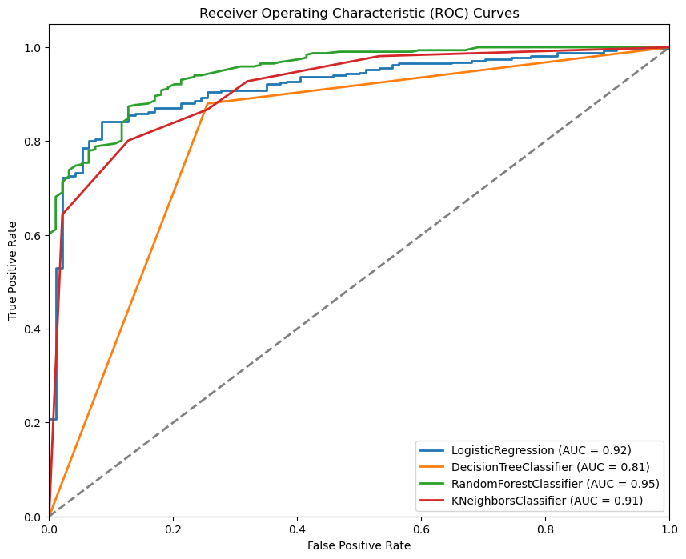
    


# **Evaluation**

### **Base Model - Phone Specification Classifier (High-Spec or Low-Spec)**
---
1. **Logistic Regression (LR)**:
 
   - **Interpretation**: LR correctly predicts 82.48% of the phone specifications overall. It has a good balance between precision and recall.

2. **Decision Tree Classifier (DTC)**:

   - **Interpretation**: DTC performs well with high accuracy and balanced precision and recall. It may be overfitting the data.

3. **Random Forest Classifier (RFC)**:

   - **Interpretation**: RFC achieves high accuracy and maintains good precision and recall. It's a strong performer.

4. **K-Nearest Neighbors (KNN)**:

   - **Interpretation**: KNN performs adequately but has lower accuracy compared to other models.

Overall, the Random Forest Classifier seems to be the best-performing model for the phone specification classification task.

### **Model 2 - Phone Price Classifier (Expensive or Affordable)**
---
1. **Logistic Regression (LR)**:

   - **Interpretation**: LR correctly predicts 85.16% of phone prices overall. It has high precision, meaning it accurately identifies expensive phones.

2. **Decision Tree Classifier (DTC)**:

   - **Interpretation**: DTC performs well with high accuracy and balanced precision and recall. It may be overfitting the data.

3. **Random Forest Classifier (RFC)**:

   - **Interpretation**: RFC achieves high accuracy and maintains good precision and recall. It's a strong performer.

4. **K-Nearest Neighbors (KNN)**:

   - **Interpretation**: KNN performs adequately but has lower accuracy compared to other models.

Overall, both Decision Tree Classifier and Random Forest Classifier seem to be good choices for the phone price classification task.

### **Metrics Justification:**
- **Accuracy**: Measures overall correctness but may not be sensitive to class imbalances.

- **Recall**: Important for identifying true positives (e.g., correctly predicting high-spec phones).

- **Precision**: Relevant for minimizing false positives (e.g., not misclassifying low-spec phones as high-spec).

- **F1 Score**: Balances precision and recall.

### **Final Model Recommendation:**
- Considering the business context, I recommend using the **Random Forest Classifier** for both the **Phone Specification Classifier** and **Phone Price Classifier**.

- It has the highest accuracy and is interpretable.

### **Implications:**
---
- By predicting whether a phone is high-spec or low-spec, Samsung can:

    - Optimize marketing strategies for each category.

    - Allocate resources effectively for the upcoming new product.📱

    - Enhance customer satisfaction by focusing on key features.

# Conclusion
## Feature Recommendations


```python
# Create a new column 'phone_category' based on 'Spec_score_category' and 'Price_category'
data['phone_category'] = data['Spec_score_category'] + ', ' + data['Price_category']

# Plots
eda.plot_features_against_price(data, feature_y = 'filtered_ram', color_feature = 'phone_category',
                                symbol_feature = 'phone_category',
                                plot_title = "Phone Price and RAM Recommendation")
eda.plot_features_against_price(data, feature_y = 'Processor', color_feature = 'phone_category',
                                 symbol_feature = 'phone_category',
                                 plot_title = "Phone Price and Processor Recommendation")
eda.plot_features_against_price(data, feature_y = 'Inbuilt_memory', color_feature = 'phone_category',
                                 symbol_feature = 'phone_category',
                                 plot_title = "Phone Price and Inbuilt Memory Recommendation")
eda.plot_features_against_price(data, feature_y = 'Display_size_inches', color_feature = 'phone_category',
                                 symbol_feature = 'phone_category',
                                 plot_title = "Phone Price and Display Size Recommendation")
eda.plot_features_against_price(data, feature_y = 'Battery_numeric', color_feature = 'phone_category',
                                 symbol_feature = 'phone_category',
                                 plot_title = "Phone Price and Battery Capacity Recommendation")
```

<p align="center">
    
</p>
<p align="center"></p>

<p align="center">
    
</p>
<p align="center"></p>

<p align="center">
    
</p>
<p align="center"></p>

<p align="center">
    
</p>
<p align="center"></p>

<p align="center">
    
</p>
<p align="center"></p>


*Recommendations*


```python
# Create a DataFrame with Feature and Recommendation columns

# Define the recommendations dictionary
recommendations = {'Price': '42K', 'RAM': '8 GB & 12 GB', 'Processor': 'Octa Core', 
                    'Inbuilt Memory': '128 GB or 256 GB', 'Display Size': '6.1 - 6.5 inches', 
                    'Battery Capacity': '5000 mAh'}

# Create the DataFrame
df = pd.DataFrame(list(recommendations.items()), columns=['Feature', 'Recommendation'])
df
```


<div>
<style scoped>
    .dataframe tbody tr th:only-of-type {
        vertical-align: middle;
    }

    .dataframe tbody tr th {
        vertical-align: top;
    }

    .dataframe thead th {
        text-align: right;
    }
</style>
<table border="1" class="dataframe">
  <thead>
    <tr style="text-align: right;">
      <th></th>
      <th>Feature</th>
      <th>Recommendation</th>
    </tr>
  </thead>
  <tbody>
    <tr>
      <th>0</th>
      <td>Price</td>
      <td>42K</td>
    </tr>
    <tr>
      <th>1</th>
      <td>RAM</td>
      <td>8 GB &amp; 12 GB</td>
    </tr>
    <tr>
      <th>2</th>
      <td>Processor</td>
      <td>Octa Core</td>
    </tr>
    <tr>
      <th>3</th>
      <td>Inbuilt Memory</td>
      <td>128 GB or 256 GB</td>
    </tr>
    <tr>
      <th>4</th>
      <td>Display Size</td>
      <td>6.1 - 6.5 inches</td>
    </tr>
    <tr>
      <th>5</th>
      <td>Battery Capacity</td>
      <td>5000 mAh</td>
    </tr>
  </tbody>
</table>
</div>


